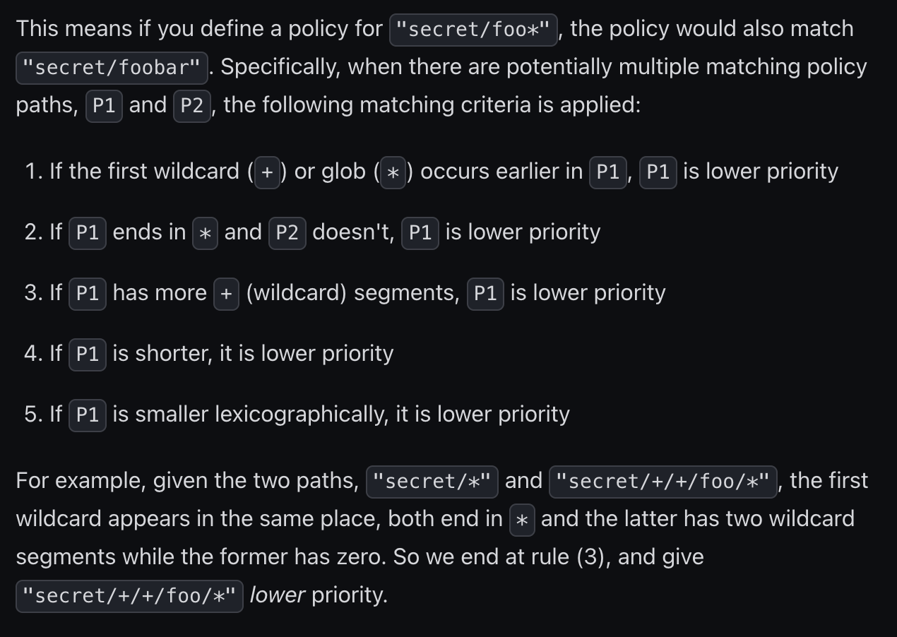

<H1>Functional: Customer Response to a known issue</H1>

Ticket 1:

```
Hello Joe,

Thanks for reaching out to the HCP support team. My name is Gary and I will be assisting you with this request.

Looking at the policy that you have provided, you are wanting to restrict access to the path "apps/*" while also allowing additional access to the path "apps/data/+/+/secrets/*" . Unfortunately in this case the way the priority rules are structured, the "apps/*" policy has higher priority. Here is a snippet from our documentation that explains why: 
```

```
Source: https://developer.hashicorp.com/vault/docs/concepts/policies#policy-syntax

The recommended solution for this scenario would be to specify each unique path "apps/data/+/+/secrets/*" in the '/+/+' portion of this path.

I understand that this isn't the ideal solution for for your policy use case, but I hope my explanation has provided insight on how to move forward with your policy creation.

If you have any additional questions or need any further clarification on this, feel free to replay to this email and we will be glad to assist.

Best Regards,

Gary Singer
Support Engineer - HCP
HashiCorp
```


Ticket 2:

```
Hello Hashicorp User,

Thanks for reaching out to the HCP support team. My name is Gary and I will be assisting you with this request.

Since you are trying to access the Private address for the HCP Vault Cluster, a peering connection between cluster and your AWS VPC will need to be established. We have a guide on how to set that up here: https://developer.hashicorp.com/hcp/tutorials/networking/amazon-peering-hcp 

If you are wanting to connect multiple AWS VPCs then you can setup an AWS Transit setup using this guide: https://developer.hashicorp.com/hcp/tutorials/networking/amazon-transit-gateway

If you have any questions or need any clarification on the information above, feel free to reply directly to this email and we will be glad to help.

Best Regards,

Gary Singer
Support Engineer - HCP
HashiCorp
```

Notes: From the customers initial request it appears that they have already setup a HCP Vault Cluster. They are wanting more information on how to connect to the private address of the cluster.

They mentioned wanting to connect their EC2 instances(multiple?) so I provided both the peering guide if they just want to connect one to one as well as the transit gateway if they are wanting to connect multiple AWS VPCs to the HCP Vault Cluster.

I found the links while reading the steps on the guide the customer linked under the note for step 9.


